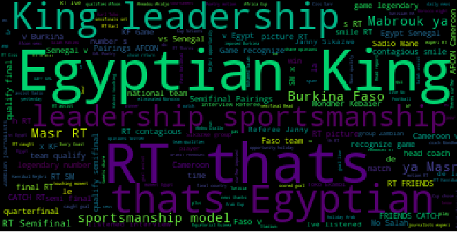
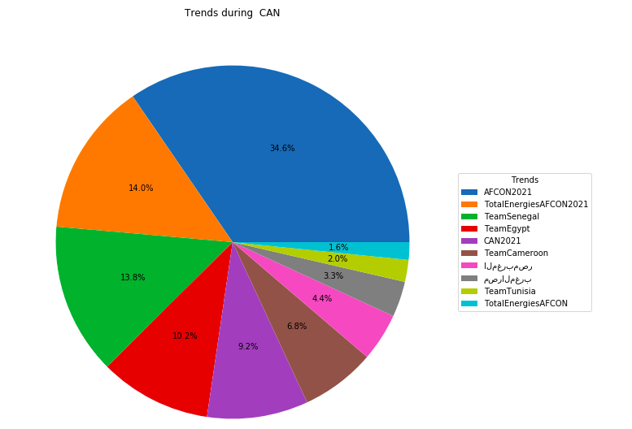

# data-collection-and-visualization

This project aims to collect data from social media (tweeter) using the python library tweepy.    
I chose as a topic of analysis the CAN 2021 organized in Cameron.   
I first collected almost 2000 tweets, using the proprietary tag search available in teweepy.   
The second step I performed is data cleaning, indeed the collected data was noisy and full of irrelevant characters, like emojis, hashtags and stop words.   
Finally, in the visualization step, I visualized useful information such as the most tweeted topics and the evolution of the trend during the CAN.   
This project is fully available on github.   
link: https://github.com/YahyaCheikh/data-collection-and-visualization   
   

